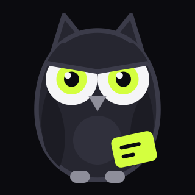

# Cram



Point your phone at a lecture slide, a textbook page, or your own handwriting - or
import a PDF, a screenshot, or a photo you already have.
Get flashcards in about three seconds.

Expo / React Native, iOS-first. The whole product is one gesture: **shutter →
cards**. Everything else in the app is in service of that, and anything that
gets in front of it is a bug.

## Run it

```bash
npm install
npx expo start
```

Scan the QR code with Expo Go on your phone. The camera does not work in the
iOS Simulator — you need a real device.

The app talks to a small proxy that holds the Anthropic API key. Set it up
first (`server/README.md`). Without it every scan fails with "Can't reach the
Cram API" and no deck is ever made. The short version:

```powershell
cd server
npm install
# open server/.env and paste your key after ANTHROPIC_API_KEY=
node local.js
```

Leave `app.json` → `extra.apiBaseUrl` at `http://localhost:3000` while
developing: on a phone in Expo Go the app swaps `localhost` for your laptop's
address automatically (it borrows it from Metro). Both devices must be on the
same wifi. Set it to the deployed URL only for a production build.

## Layout

```
App.js                     screen state machine
src/theme.js               all colors, type, motion — nothing hardcoded elsewhere
src/screens/
  CameraScreen.js          opens straight to camera, no home screen
  GeneratingScreen.js      the 2-4s wait, narrated
  StudyScreen.js           card stack + rating, edit/delete a card
  LibraryScreen.js         this week (exams), saved decks, streak, due
  ExamEditorScreen.js      name, date, linked decks
  PaywallScreen.js         three plans
src/components/
  Flashcard.js             tap to flip, swipe to rate
  Mascot.js                Volt, the owl - four moods, react-native-svg
  CardEditor.js            fix a card the model got wrong
  ErrorBoundary.js         crash screen with a way back
  PrimaryButton.js
src/lib/
  api.js                   resize, upload, parse
  storage.js               decks, free-tier meter, streak (AsyncStorage)
  srs.js                   trimmed SM-2 scheduling
  share.js                 deck -> plain text for the share sheet
  entitlements.js          plans + the RevenueCat seam  ← see TODO
assets/mascot/             Volt as clean SVG: transparent + app-icon variant
public/                    terms + privacy, copied into the web build
server/api/generate.js     the Claude call
```

## Before the App Store — what is still open

**1. Billing is not wired up.** `src/lib/entitlements.js` has working plan
definitions and quota logic, but `purchase()` and `restore()` throw. The file
has step-by-step notes at the top. Roughly:

```bash
npx expo install react-native-purchases
```

Create these products in App Store Connect, then the matching offering in
RevenueCat. The IDs must match `PLANS` exactly:

| Product ID | Type | Price |
|---|---|---|
| `cram_weekly` | Auto-renewing weekly | $3.99, 1-week free trial |
| `cram_semester` | Non-renewing, 4 months | $19.99 |
| `cram_annual` | Auto-renewing yearly | $39.99 |

**2. Test with admin mode, not the global unlock.** `app.json` →
`extra.unlockAll` is `false` and should stay that way — `true` gives every
install Pro for free. To get unlimited scans on your own phone:

1. Set `CRAM_ADMIN_KEY` on the server (any long random string; see
   `server/README.md`).
2. In the app, tap the **CRAM** wordmark on the camera screen five times.
3. Type the key. The pill turns to `ADMIN`.

Admin skips the free-tier meter, the PDF gate, the fair-use ceiling and the
server's per-IP rate limit. Same five taps offers to turn it off, so you can
check the paywall and free tier on the same phone. The key is verified by the
server and never bundled into the app, so nobody can pull it out of the IPA.
Everyone who isn't admin sees the free tier until they buy or start the trial —
which still needs step 1.

**3. Icon and splash** are rendered from `assets/mascot/volt-icon.svg` and `volt.svg`. If the mascot changes, re-export the PNGs in `assets/` (1024px, the iOS icon with no alpha).

**4. Terms and privacy pages** are in `public/` and ship with the web build, so
they are live wherever Vercel deploys it. Set `app.json` → `extra.siteUrl` to
that domain (it defaults to `https://cram.vercel.app`, which is a guess). Apple
rejects subscription apps whose legal links 404 — this is the single most
common rejection reason for this app category, so open both links from the
paywall on a real device before submitting. The pages are a plain-English
draft, not legal advice; read them once.

**5. Crash reporting is wired but dormant.** `@sentry/react-native` is set up
(errors only - no replay, no tracing, no PII) and does nothing until
`app.json` → `extra.sentryDsn` has a DSN. Your Sentry org only lets owners
create projects: have the owner create a project called `cram` in
`north-beam-llc` (platform React Native), copy its DSN into `extra.sentryDsn`,
and crashes start arriving. Don't point it at the existing `react-native`
project - that is a different app.

**6. The app key is a placeholder.** `app.json` → `extra.appKey` and the
server's `CRAM_APP_KEY` both say `change-me`. They have to match.

## Submitting

```bash
npm install -g eas-cli
eas login
eas build --platform ios --profile production
eas submit --platform ios
```

You do not need a Mac for this. You do need an Apple Developer account ($99/yr)
and, before the first build, `eas build:configure`.

Apple's review notes should say the app requires the camera and give them a
photo of a textbook page to point it at — reviewers reject scan apps they can't
figure out how to test.

## What's free and what isn't

| | Free | Pro (trial included) |
|---|---|---|
| Camera capture | ✓ | ✓ |
| Photo library import | ✓ | ✓ |
| **PDF / document import** | — | ✓ |
| Cards per day | 10 | unlimited |

The one-week trial is **full Pro** — unlimited cards and PDFs — because
RevenueCat reports the `pro` entitlement as active for the whole trial period.
A trial user is a Pro user until they cancel.

Behind that sits `FAIR_USE_DAILY_SCANS` (60/day), which exists solely to stop
someone taking a free week, running hundreds of PDFs through it, and
cancelling. A heavy student does 20–30 scans on a bad day, so nobody real will
meet it, and the UI never shows a countdown — subscribers just see `PRO`. If it
does trip, they get a note, never the paywall they already bought.

**PDF import is deliberately Pro-only.** Two reasons that happen to agree: a
50-page PDF can produce a hundred cards in a single request, which makes a
10-card daily limit meaningless; and it is by far the most expensive call we
send. Gating it also gives the paywall something concrete to sell rather than
just "more of the same". The check lives in `canUseDocuments()` in
`src/lib/entitlements.js` — one function if you want to change the policy.

## Studying

- **This week.** Top of the library: exams with a countdown, the decks tied
  to them, how much is learned and how much is due. Tap one to study
  everything due for that exam (or all of it, the night before). The nearest
  exam also sits on the camera screen. Countdown turns amber at 3 days, rose
  at 1. Long-press to edit; a finished exam lingers a day, crossed off.

- **Four modes, one schedule.** Chips under the deck title switch between
  **Cards** (flip and rate), **Quiz** (multiple choice - the wrong answers are
  other cards from the same deck, so it is the first pass over new material),
  **Write** (type the answer, get an honesty check, grade yourself) and
  **Blitz** (60 seconds, Nope / Got it, for the night before). Every mode
  rates the same cards into the same SM-2 schedule.
- **Swipe or tap to rate.** Again / Hard / Got it feed a trimmed SM-2; a card
  you know comes back in 1, 3, then ~8 days.
- **Daily reminder, and the nag.** Settings (gear in the library) → pick a
  time. Five minutes after the reminder, if the app has not been opened, a
  second one fires with its own alarm sound and vibration, marked
  time-sensitive so it gets through Focus. Opening the app cancels it.
  "Send me a test alarm" plays the loud one 30 seconds later so it can be
  heard today. Local notifications only; the custom sound needs a real build
  (Expo Go plays the default sound). Not available on web. What it cannot do:
  ring like a phone call - Apple only allows that for real VoIP calls.
- **Backup and restore.** Settings → Export all decks writes one JSON file
  you can keep in Files, iCloud Drive or an email. Import merges it back and
  never rolls progress back. Share deck → "As a file" uses the same format,
  so a friend's copy arrives with hints and scheduling intact; they open it
  via Import → PDF or file. Free, no account needed.
- **Dev builds** get a "use sample cards instead" link on the request-failed
  screen, so the whole app can be exercised on a machine with no API key.
- **Why?** on the back of any card. Volt explains why the answer is the
  answer, in two or three sentences - not a restatement. Cached on the card so
  it is one call per card, ever. Free users get three a day; Pro is unlimited.
- **Edit** in the study header fixes the card in front of you, or deletes it.
  The model misreads a number now and then; this is cheaper than a new scan.
- **Write or paste - free, no server.** Import → "Write or paste", or "New"
  in the library. Type cards, or paste notes / a Quizlet export / a deck a
  friend shared from Cram - `Q:`/`A:` lines, tabs and `term - definition`
  are all recognised, with a live "N cards found" count. Costs nothing per
  user and is never gated, which is the point: one student scans, the rest
  of the study group pastes.
- **Paste notes, let the AI write the questions.** In the paste box, once
  there is a paragraph or more, "Write the questions for me" sends the text to
  the model. Same quota and paywall as a scan; about a tenth of the cost.
- **Feedback.** Settings → "What should Cram do next?", and a quiet link on
  the deck-finished screen. Goes to `/api/feedback` (GitHub issues if
  configured, server logs otherwise); with no server it falls back to email
  via `extra.feedbackEmail` in app.json - set that before launch.
- **Review before you send.** Every photo - shutter or library - lands on a
  review grid first. Shoot a whole lecture slide by slide, pick ten
  screenshots at once from Photos, drop a blurry one, then make one deck from
  all of them (up to 20 pages). A PDF skips review; there is nothing to look at.
- **Add another page** after a run (or long-press a deck) puts the camera in
  append mode - the next scan's cards join that deck instead of making a new
  one. A lecture is thirty slides, not thirty decks.
- **Review what's due** on the library pulls every due card across every deck
  into one session. Ratings route back to the deck each card came from.
- **Streak** counts consecutive days with at least one card rated. Shown from
  two days up; a single day is not a streak.
- **Share deck** puts the cards on the share sheet as plain text - it reads
  fine in iMessage and pastes into Anki.

## Design rules

Worth keeping, because the design is the marketing here — the launch is a
15-second screen recording, and if it doesn't read muted, it doesn't work.

- **Camera opens on launch.** No home screen, no onboarding, no sign-in.
- **Three seconds, shutter to first card.** If the real number climbs, cut the
  work, don't add a nicer spinner.
- **One accent color.** Acid lime on near-black, and nothing else competes.
- **Every interaction gets haptics.** It's most of why the thing feels physical.
- **Motion comes from three springs** in `theme.js`. Don't add a fourth.
